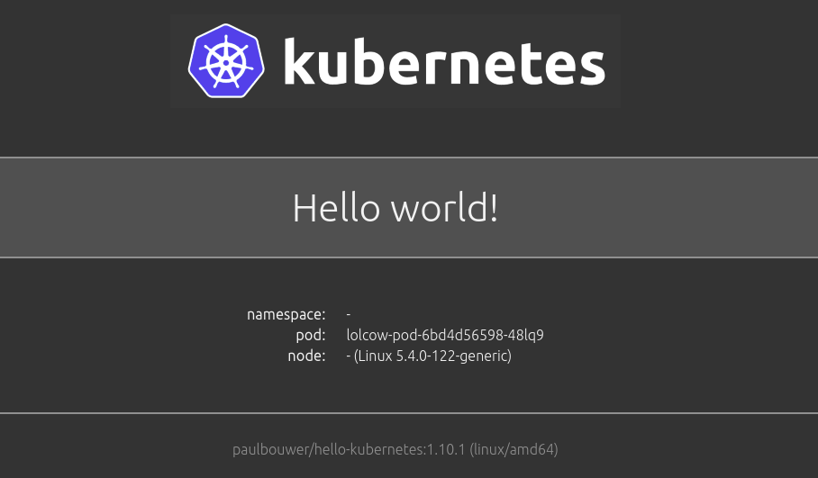

# LolCow Operator

> Making my first Kubernetes operator!

I've always wanted to develop for Kubernetes, and I have my first opportunity and
wanted to give it a try! Per instruction of my friend and colleague [Eduardo](https://github.com/ArangoGutierrez/)
I am going to create a simple operator that takes a string argument for a controller,
and then you can update the string and the operator will print it. I'm
going to be marginally following [this guide](https://developers.redhat.com/articles/2021/09/07/build-kubernetes-operator-six-steps)
and also note [this is a nice example](https://github.com/kubernetes-sigs/kueue/blob/main/pkg/controller/core/queue_controller.go)
for a controller. This means that:

 - I have a recent version of Go installed (1.18.1)
 - I also have minikube installed
 - my lolcow operator container is prebuilt at [ghcr.io/vsoch/lolcow-operator](https://github.com/vsoch/lolcow-operator/pkgs/container/lolcow-operator)
  
## Making the operator

### 1. Installation

I first [installed the operator-sdk](https://sdk.operatorframework.io/docs/installation/)

```bash
export ARCH=$(case $(uname -m) in x86_64) echo -n amd64 ;; aarch64) echo -n arm64 ;; *) echo -n $(uname -m) ;; esac)
export OS=$(uname | awk '{print tolower($0)}')
```
```bash
export OPERATOR_SDK_DL_URL=https://github.com/operator-framework/operator-sdk/releases/download/v1.22.2
curl -LO ${OPERATOR_SDK_DL_URL}/operator-sdk_${OS}_${ARCH}
```
```bash
gpg --keyserver keyserver.ubuntu.com --recv-keys 052996E2A20B5C7E
```
```bash
curl -LO ${OPERATOR_SDK_DL_URL}/checksums.txt
curl -LO ${OPERATOR_SDK_DL_URL}/checksums.txt.asc
gpg -u "Operator SDK (release) <cncf-operator-sdk@cncf.io>" --verify checksums.txt.asc
```
```bash
grep operator-sdk_${OS}_${ARCH} checksums.txt | sha256sum -c -
```
```bash
$ which operator-sdk
/usr/local/bin/operator-sdk
```

### 2. Start Minikube

I just did:

```bash
$ minikube start
```
Although in the instructions I've seen:

```bash
$ minikube start init
```

### 3. Local Workspace

At this point, I made sure I was in this present working directory, and I created
a new (v2) module and then "init" the operator:

```bash
$ go mod init vsoch/lolcow-operator
$ operator-sdk init
```

### 4. Create Controller

Now let's create a controller, and call it Lolcow

```bash
$ operator-sdk create api --version=v1alpha1 --kind=Lolcow
```

Make sure to install all dependencies (I think this might not be necessary - I saw it happen when I ran the previos command).

```bash
$ go mod tidy
$ go mod vendor
```

### 5. Make Manifests

At this point, we want to edit [controllers/lolcow_controller.go](controllers/lolcow_controller.go).
There is a good example to get started [here](https://github.com/deepak1725/hello-operator2/blob/main/controllers/traveller_controller.go).

Some design decisions I started to make:

1. If we expect to have more than one named API, it makes sense to have another directory under [api](api) (e.g., for lolcow).
2. If we want special struct/functions for a particular named api, this should be a custom package under [pkg](pkg) (so I created this directory, e.g., `pkg/lolcow`). The reason (I think) is because different versions of an API might want to use shared code.
3. kueue puts a lot of the controller logic under [pkg](https://github.com/kubernetes-sigs/kueue/tree/e571d42e390f96a95efa799d720777e92e4f69a4/pkg) but I'm not convinced I want that yet.
4. The examples use `mydomainv1alpha1` to reference the API package. This probably makes sense if you are importing different versions (why?) but my preference (only importing one) is to name it something simple like `api`.
5. I realized that if we want more than one controller, we should have subdirectories in controllers too. I mirrored the kueue design and made one called "core."
6. Since I don't know the ultimate design wanted (e.g., queue doesn't directly make a deployment or service but does via a queue manager) I mimicked the hello world example and made a deployment / service. I'd like to try making my own web UI to deploy for lolcow.

For all points, given that you are changing a path, make sure to grep for the old one so you don't miss updating one ;)

```bash
$ grep -R "vsoch/lolcow-operator/api"
PROJECT:  path: vsoch/lolcow-operator/api/v1alpha1
controllers/suite_test.go:	mydomainv1alpha1 "vsoch/lolcow-operator/api/v1alpha1"
controllers/lolcow_controller.go:	lolcow "vsoch/lolcow-operator/api/lolcow/v1alpha1"
main.go:	mydomainv1alpha1 "vsoch/lolcow-operator/api/v1alpha1"
```

When you finish developing (or as you develop!) you can do:

```bash
# quicker way to get errors to debug
$ go build main.go
```

And then officially build.
```bash
$ make
```

To make your manifests:

```bash
$ make manifests
```

And install?

```bash
$ make install
```

### 6. Deploy

At this point, edit the config yamls [here](config/samples/_v1alpha1_lolcow.yaml). We need to add a greeting, and port:


```yaml
apiVersion: my.domain/v1alpha1
kind: Lolcow
metadata:
  name: lolcow-sample
spec:
  greeting: HELLO
  port: 30685
```

**note** it doesn't seem to be getting my port (set to zero) likely a bug?
And then apply (kustomize is in the bin).

```bash
$ bin/kustomize build config/samples | kubectl apply -f -
lolcow.my.domain/lolcow-sample created
```

And finally, run it.

```bash
$ make run
```

And you should be able to open the web-ui:

```bash
$ minikube service backend-service
```

This isn't perfect yet, but it's a start!



And then when it's running (in a separate terminal) change the greeting and do:

```bash
$ bin/kustomize build config/samples | kubectl apply -f -
lolcow.my.domain/lolcow-sample configured
```

### Current Bugs

1. The starting config port doesn't seem to take - I think maybe we need to set it
2. When I apply the config above, it tells me the port is already allocated, so maybe we need to delete/re-create the service?
3. The message (greeting) should be passed to the container and appear in the UI (it does not).

I'd like to better understand what's going on under the hood here, but for now I'm happy to have something that sort of works!

## Building Operator Container

**note** you shouldn't need to do this as it will pull from GitHub packages, but if you want to locally test, this
is how you do it!

### 1. Build the Container

```bash
$ docker build -f docker/Dockerfile -t ghcr.io/vsoch/lolcow-operator .
```

And then you can run it without a statement (and we will use the fortune command to get one) or with a custom statement.

```bash
$ docker run -p 8080:8080 -it ghcr.io/vsoch/lolcow-operator  "Oh my gosh, I am a cow in a container!"
$ docker run -p 8080:8080 -it ghcr.io/vsoch/lolcow-operator  
```

This will be the container we deploy to our operator, with entrypoint modified with our greeting.
 
After the greeting you'll see that a web server is started, and you can open up to [http://localhost:8080](http://localhost:8080) to see it.

```bash
$ docker run -it -p 8080:8080 ghcr.io/vsoch/lolcow-operator
 ____________________________________
< Be cautious in your daily affairs. >
 ------------------------------------
        \   ^__^
         \  (oo)\_______
            (__)\       )\/\
                ||----w |
                ||     ||
 * Serving Flask app 'app'
 * Debug mode: off
WARNING: This is a development server. Do not use it in a production deployment. Use a production WSGI server instead.
 * Running on all addresses (0.0.0.0)
 * Running on http://127.0.0.1:8080
 * Running on http://172.17.0.2:8080
Press CTRL+C to quit
```

And then when you open to [http://localhost:8080](http://localhost:8080) you will see a *much improved* lol cat... has turned
into Nyan Cat!


## Troubleshooting

If you see:

```bash
1.6605195805812113e+09	ERROR	controller-runtime.source	if kind is a CRD, it should be installed before calling Start	{"kind": "Lolcow.my.domain", "error": "no matches for kind \"Lolcow\" in version \"my.domain/v1alpha1\""}
```

You need to remove the previous kustomize and install the CRD again:

```bash
$ rm bin/kustomize
$ make install
```

If you get an error that the port is already allocated, I think we can eventually handle this, but for now I'm deleting the service:

```bash
$ kubectl delete svc backend-service
```

## Wisdom

**from the kubebuilder slack**

Some learned knowledge:
- Reconciling should only take into account the spec of your object, and the real world.  Don't use status to hold knowledge for future reconcile loops.  Use a workspace object instead.
- Status should only hold observations of the reconcile loop.  Conditions, perhaps a "Phase", IDs of stuff you've found, etc.
- Use k8s ownership model to help with cleaning up things that should automatically be reclaimed when your object is deleted.
- Use finalizers to do manual clean-up-tasks
- Send events, but be very limited in how often you send events.  We've opted now to send events, essentially only when a Condition is modified (e.g. a Condition changes state or reason).
- Try not to do too many things in a single reconcile.  One thing is fine.  e.g. see one thing out of order?  Fix that and ask to be reconciled.  The next time you'll see that it's in order and you can check the next thing.  The resulting code is very robust and can handle almost any failure you throw at it.
- Add "kubebuilder:printcolums" markers to help kubectl-users get a nice summary when they do "kubectl get yourthing".
- Accept and embrace that you will be reconciling an out-of-date object from time to time.  It shouldn't really matter.  If it does, you might want to change things around so that it doesn't matter.  Inconsistency is a fact of k8s life.
- Place extra care in taking errors and elevating them to useful conditions, and/or events.  These are the most visible part of an operator, and the go-to-place for humans when trying to figure out why your code doesn't work.  If you've taken the time to extract the error text from the underlying system into an Event, your users will be able to fix the problem much quicker.

### What is a workspace?

A workspace object is when you need to record some piece of knowledge about a thing you're doing, so that later you can use that when reconciling this object. MyObject "foo" is reconciled; so to record the thing you need to remember, create a MyObjectWorkspace — Owned by the MyObject, and with the same name + namespace.  MyObjectWorkspace doesn't need a reconciler; it's simply a tool for you to remember the thing. Next time you reconcile a MyObject, also read your MyObjectWorkspace so you can remember "what happened last time". E.g. I've made a controller to create an EC2 instance, and we needed to be completely sure that we didn't make the "launch instance" API call twice.  EC2 has a "post once only" technique whereby you specify a nonce to avoid duplicate API calls.  You would write the nonce to the workspace use the nonce to call the EC2 API write any status info of what you observed to the status. Rremove the nonce when you know that you've stored the results (e.g. instance IDs or whatever) When you reconcile, if the nonce is set, you can re-use it because it means that the EC2 call failed somehow.  EC2 uses the nonce the second time to recognise that "heh, this is the same request as before ..." Stuff like this nonce shouldn't go in your status. Put simply, the status should really never be used as input for your reconcile.


Know that the scaffolded k8sClient includes a cache that automatically updates based on watches, and may give you out-of-date data (but this is fine because if it is out-of-date, there should be a reconcile in the queue already). Also know that there is a way to request objets bypassing a cache (look for APIReader).  This gives a read-only, but direct access to the API.  Useful for e.g. those workspace objects.
